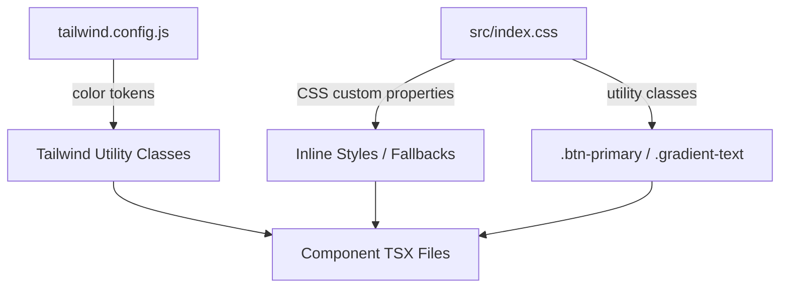

# Design Document: Territory Map Branding

## Overview

This design describes the technical approach for rebranding the TerritoryMap application from its current generic blue/gray Tailwind color scheme to ArcBot's purple-and-orange dual-accent dark theme. The migration touches three layers:

1. **Configuration layer** — Tailwind config brand tokens and CSS custom properties
2. **Base stylesheet layer** — Font import, body styles, reusable utility classes
3. **Component layer** — Class name and inline style replacements across all `.tsx` files

The approach is a **static, find-and-replace migration** with no runtime logic changes. The app's functional behavior remains unchanged; only visual presentation is affected.

## Architecture

The branding system follows a token-based architecture where colors flow from a single source of truth:



**Design Decision**: Colors are defined in both `tailwind.config.js` (for Tailwind utilities like `bg-accent-orange`) and `index.css` CSS custom properties (for inline styles and non-Tailwind contexts). This dual definition ensures brand colors are available regardless of whether a component uses Tailwind classes or inline style objects.

## Components and Interfaces

### 1. Tailwind Configuration (`tailwind.config.js`)

Extends the default theme with semantic color tokens:

```typescript
// theme.extend.colors
{
  accent: {
    orange: '#FF6B2C',
    purple: '#9B30FF',
  },
  brand: {
    primary: '#9B30FF',
    'primary-dark': '#8a1ef0',
    'primary-darker': '#7f14e6',
    'primary-darkest': '#6810bd',
    'primary-light': '#a94aff',
    'primary-lighter': '#b35fff',
    'primary-lightest': '#c685ff',
  },
  surface: {
    bg: '#111118',
    card: '#1a1a24',
    hover: '#22222e',
    border: '#2a2a3a',
  },
  text: {
    emphasis: '#f0f0f5',
    muted: '#8888a0',
  },
}

// theme.extend.fontFamily
{
  sans: ['Inter', 'ui-sans-serif', 'system-ui', 'sans-serif', '"Apple Color Emoji"', '"Segoe UI Emoji"', '"Segoe UI Symbol"'],
}
```

### 2. Base Stylesheet (`src/index.css`)

Additions to the existing stylesheet:

- **Google Fonts import**: Inter with weights 400, 500, 600, 700 and `display=swap`
- **CSS custom properties** under `:root` for all brand palette and surface colors
- **Body styles**: `background: #111118; color: #f0f0f5; font-family: 'Inter', system-ui, -apple-system, sans-serif`
- **`.btn-primary`** utility: applies `bg-gradient-to-r from-accent-orange to-accent-purple` with hover opacity transition
- **`.gradient-text`** utility: applies background-clip text gradient fill

### 3. Component Migration Map

The following components require class/style changes:

| Component | Change Type | Scope |
|-----------|-------------|-------|
| `AllianceMapManager.tsx` | Tailwind class replacement | Buttons, backgrounds, borders, text colors, gradient headings |
| `FrankensteinEventTab.tsx` | Tailwind classes + inline styles | Tool buttons, panel backgrounds, borders |
| `ControlsBar.tsx` | Tailwind class replacement | Export button, reset button, input borders, backgrounds |
| `PlayerListPanel.tsx` | Tailwind class replacement | Input focus borders, button colors, backgrounds |
| `AvailablePanel.tsx` | Tailwind class replacement | Panel backgrounds, header background |
| `ResetModal.tsx` | Tailwind class replacement | Card background |

### 4. Color Migration Reference

| Current Class/Value | Replacement | Context |
|---------------------|-------------|---------|
| `bg-gray-900` | `bg-surface-bg` | Page-level backgrounds |
| `bg-gray-800` | `bg-surface-card` | Cards, panels, containers |
| `bg-gray-700` | `bg-surface-hover` | Hover states, active tabs |
| `border-gray-700` | `border-surface-border` | Section borders |
| `bg-blue-600 hover:bg-blue-700` | `bg-gradient-to-r from-accent-orange to-accent-purple hover:opacity-90` | Primary action buttons |
| `bg-indigo-600 hover:bg-indigo-500` | `bg-gradient-to-r from-accent-orange to-accent-purple hover:opacity-90` | Export buttons |
| `border-blue-500` | `border-accent-purple` | Active selection borders |
| `text-blue-400` (active labels) | `text-brand-primary-light` | Highlighted active text |
| `text-blue-400` (creator) | `text-accent-orange` | Creator attribution |
| `text-purple-400` (Discord) | `text-accent-purple` | Discord username |
| `text-gray-400` | `text-text-muted` | Secondary text |
| `text-gray-300` | `text-text-muted` | Slightly emphasized secondary text |
| `focus:ring-indigo-400/500` | `focus:ring-accent-purple` | Focus indicators |
| `focus:ring-gray-400/500` | `focus:ring-accent-purple` | Focus indicators |
| `hover:border-gray-600/500` | `hover:border-[rgba(155,48,255,0.4)]` | Card hover borders |
| `hover:border-indigo-400` | `hover:border-accent-purple` | Interactive element hover |
| `#1a1a2e` (inline) | `#1a1a24` | Inline background colors |
| `#2a2a4a` (inline) | `#2a2a3a` | Inline border colors |
| `rgba(15,15,30,0.92)` | `rgba(17,17,24,0.92)` | Floating panel backgrounds |
| `rgba(15,15,30,0.88)` | `rgba(17,17,24,0.88)` | Semi-transparent overlays |

## Data Models

No data model changes. This feature is purely visual — no state, API, or storage changes.

## Correctness Properties

*A property is a characteristic or behavior that should hold true across all valid executions of a system — essentially, a formal statement about what the system should do. Properties serve as the bridge between human-readable specifications and machine-verifiable correctness guarantees.*

No testable properties. Property-based testing is not applicable to this feature. The territory-map-branding spec is a visual theming migration that replaces static CSS class names and inline color hex values. There are no pure functions, data transformations, parsers, serializers, or algorithmic behaviors whose correctness varies with input. Each change is a deterministic one-to-one substitution (e.g., `bg-gray-900` → `bg-surface-bg`). The correct testing approach is build verification, visual inspection, and example-based snapshot/unit tests as described in the Testing Strategy section.

## Error Handling

- **Font loading failure**: The `display=swap` parameter on the Google Fonts import ensures text remains visible with system fonts while Inter loads. The Tailwind `fontFamily.sans` fallback stack (`ui-sans-serif, system-ui, sans-serif`) provides graceful degradation.
- **Missing custom property**: If a CSS custom property is undefined (e.g., older browser), the Tailwind-generated utility classes still resolve correctly since they use direct hex values in the compiled CSS.
- **Existing default Tailwind classes**: The configuration uses `theme.extend` (not `theme` override), so all default Tailwind utilities like `bg-gray-900`, `text-white`, `border-red-500` remain available for non-migrated or semantic uses (e.g., error states retain `focus:ring-red-400`).

## Testing Strategy

### Why Property-Based Testing Does Not Apply

This feature is a **visual theming migration** — it replaces CSS class names and inline color values. There are no pure functions, data transformations, or algorithmic behaviors that vary meaningfully with input. The changes are:

- Static string replacements in configuration files
- One-to-one class name swaps in JSX
- Hex value substitutions in inline style objects

PBT requires universal properties ("for all inputs X, P(X) holds"), but there is no input space here — each change is a deterministic, one-time substitution.

### Recommended Testing Approach

**1. Build Verification (Smoke Test)**
- `npm run build` must complete without errors after all changes
- Confirms Tailwind resolves all new utility classes and no typos exist

**2. Visual Inspection / Manual QA**
- Open the app in a browser and verify each screen matches the ArcBot brand
- Check both Territory Map tab and Hive Builder tab
- Verify mobile menu toggle and responsive layout

**3. Example-Based Unit Tests**
- Verify the Tailwind config exports the expected color tokens
- Verify `.btn-primary` and `.gradient-text` classes exist in the compiled CSS
- Test that Inter font is loaded (check document font-family)

**4. Snapshot Tests (Optional)**
- Render key components and snapshot their className output
- Detect unintended class changes in future refactors

**5. Acceptance Checklist**
- [ ] All primary action buttons display orange-to-purple gradient
- [ ] Sidebar background is `#111118`, panels are `#1a1a24`
- [ ] Active alliance card has purple-tinted highlight
- [ ] Creator attribution shows orange name and purple Discord handle
- [ ] "Alliance Map Manager" title displays gradient text
- [ ] Tab headings display gradient text
- [ ] Focus rings are purple (not indigo/gray)
- [ ] Inter font is active on all text
- [ ] No remaining `bg-blue-600`, `bg-indigo-600`, or `border-blue-500` classes (outside semantic/error contexts)
- [ ] Frankenstein panel borders and backgrounds use brand surface colors
