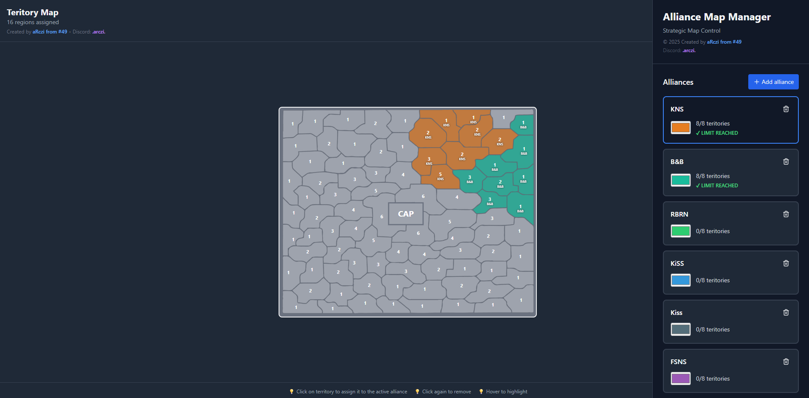

# 🗺️ Alliance Map Manager

**Interactive Territory Control System for Strategic Gaming**


---

## 📋 Table of Contents

- [Overview](#overview)
- [Features](#features)
- [Demo](#demo)
- [Installation](#installation)
- [Usage](#usage)
- [Technical Details](#technical-details)
- [Data Persistence](#data-persistence)
- [Contributing](#contributing)
- [Author](#author)
- [License](#license)

---

## 🎯 Overview

**Alliance Map Manager** is a web-based interactive map tool designed for strategic territory management in gaming communities. It allows players to visualize, assign, and track territorial control across alliances with a maximum of **8 territories per alliance**.

### Key Highlights
- ✅ **87 unique territories** with level-based strategic value (LVL 1-6)
- ✅ **Persistent user data** - your map saves automatically
- ✅ **8 territory limit** per alliance (enforced)
- ✅ **PNG export** for sharing and documentation
- ✅ **Responsive design** - works on desktop and mobile
- ✅ **Real-time statistics** and visual feedback

---

## ✨ Features

### 🎨 **Alliance Management**
- Create unlimited custom alliances
- Assign unique colors to each alliance
- Rename alliances on-the-fly
- Delete alliances (territories auto-release)

### 🗺️ **Interactive Map**
- Click territories to assign them to active alliance
- Visual hover effects with territory numbers
- Color-coded regions by alliance ownership
- Territory level indicators (1-6)

### 📊 **Statistics & Tracking**
- Real-time territory count per alliance
- Display format: `X/8 territories`
- "LIMIT REACHED" indicator when alliance is full
- Total assigned/free territories overview

### 💾 **Data Management**
- **Auto-save to localStorage** - changes persist across sessions
- **PNG Export** - download your map as an image
- **Reset function** - clear all territories instantly
- Each user has their own independent map

### 🎨 **Developer Features** (Debug Mode)
- Manual territory number positioning
- Visual editing with crosshair cursor
- Golden markers for custom positions

---

## 🚀 Demo

### Screenshot


---

## 📦 Installation

### Prerequisites
- Node.js (v16 or higher)
- npm or yarn

### Steps

1. **Clone the repository**
   ```bash
   git clone https://github.com/yourusername/alliance-map-manager.git
   cd alliance-map-manager
   ```

2. **Install dependencies**
   ```bash
   npm install
   # or
   yarn install
   ```

3. **Start development server**
   ```bash
   npm run dev
   # or
   yarn dev
   ```

4. **Open in browser**
   ```
   http://localhost:5173
   ```

---

## 🎮 Usage

### Basic Workflow

1. **Select an Alliance**
   - Click on any alliance card in the right sidebar to make it active
   - The active alliance is highlighted with a blue border

2. **Assign Territories**
   - Click on any gray (unassigned) territory on the map
   - The territory will be assigned to your active alliance
   - Click again to unassign

3. **Manage Alliances**
   - Add new alliance: Click `+ Add alliance`
   - Rename: Click on alliance name and type
   - Change color: Click color picker
   - Delete: Click trash icon (⚠️ releases all territories)

4. **Export Your Map**
   - Click `Export as PNG` to download the current map state
   - Share with your team or save for records

5. **Reset Map**
   - Click `Resetuj Mapę` to clear all territory assignments
   - Alliances remain, only territories are cleared

### Territory Limits

- Each alliance can control **maximum 8 territories**
- Attempting to exceed limit shows an alert
- You must unassign a territory before assigning a new one

---

## 🔧 Technical Details

### Tech Stack

| Technology | Version | Purpose |
|------------|---------|---------|
| React | 18.x | UI framework |
| TypeScript | 5.x | Type safety |
| Tailwind CSS | 3.x | Styling |
| Lucide React | - | Icons |
| Vite | - | Build tool |

### Project Structure

```
alliance-map-manager/
├── src/
│   ├── AllianceMapManager.tsx  # Main component
│   ├── App.tsx                 # Entry point
│   ├── main.tsx                # React DOM root
│   └── index.css               # Global styles
├── public/                     # Static assets
├── package.json                # Dependencies
└── README.md                   # Documentation
```

### Key Components

**AllianceMapManager.tsx** - Main React component containing:
- Alliance state management
- Region color mapping (87 territories)
- SVG map rendering with path elements
- localStorage integration
- Export functionality

---

## 💾 Data Persistence

### How It Works

The app uses **localStorage** for client-side data persistence:

```typescript
// Auto-saves every 500ms after changes (debounced)
localStorage.setItem('allianceMapData', JSON.stringify({
  alliances,
  regionColors,
  activeAllianceId,
  manualCenterOverrides
}));
```

### Data Structure

```json
{
  "alliances": [
    { "id": 1, "name": "KNS", "color": "#e67e22" }
  ],
  "regionColors": {
    "r1": 1,
    "r2": 2
  },
  "activeAllianceId": 1,
  "manualCenterOverrides": {}
}
```

### Clearing Data

Users can clear their data by:
1. Clicking "Resetuj Mapę" (resets territories only)
2. Browser developer tools: `localStorage.clear()`
3. Browser settings: Clear site data

---

## 🤝 Contributing

Contributions are welcome! Here's how you can help:

### Reporting Issues
- Use GitHub Issues
- Include steps to reproduce
- Add screenshots if applicable

### Pull Requests
1. Fork the repository
2. Create feature branch: `git checkout -b feature/amazing-feature`
3. Commit changes: `git commit -m 'Add amazing feature'`
4. Push to branch: `git push origin feature/amazing-feature`
5. Open a Pull Request

### Development Guidelines
- Follow existing code style
- Add TypeScript types for new features
- Test on both desktop and mobile
- Update README if adding major features

---

## 👤 Author

**aRczi S49**

- Discord: `.arczi.`
- GitHub: [@aRczi137](https://github.com/aRczi137)

### Credits
- Map data based on strategic gaming territory system
- Inspired by alliance management tools in multiplayer strategy games

---

## 📄 License

This project is licensed under the **MIT License** - see the [LICENSE](LICENSE) file for details.

```
MIT License

Copyright (c) 2025 aRczi S49

Permission is hereby granted, free of charge, to any person obtaining a copy
of this software and associated documentation files (the "Software"), to deal
in the Software without restriction, including without limitation the rights
to use, copy, modify, merge, publish, distribute, sublicense, and/or sell
copies of the Software, and to permit persons to whom the Software is
furnished to do so, subject to the following conditions:

The above copyright notice and this permission notice shall be included in all
copies or substantial portions of the Software.

THE SOFTWARE IS PROVIDED "AS IS", WITHOUT WARRANTY OF ANY KIND, EXPRESS OR
IMPLIED, INCLUDING BUT NOT LIMITED TO THE WARRANTIES OF MERCHANTABILITY,
FITNESS FOR A PARTICULAR PURPOSE AND NONINFRINGEMENT.
```

---

## 🌟 Acknowledgments

- Built with ❤️ for gaming communities
- Thanks to all beta testers and contributors
- Special thanks to strategy game enthusiasts

---

## 📞 Support

Having issues or questions?

- 💬 **Discord**: Contact `.arczi.`
- 🐛 **Bug Reports**: [GitHub Issues](https://github.com/aRczi137/Teritorymap/issues)

---

<div align="center">

**⭐ Star this repo if you find it useful! ⭐**

Made with 🗺️ by aRczi

</div>