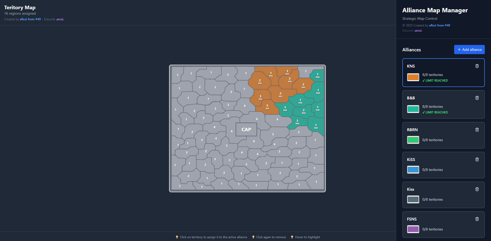

# 🗺️ Alliance Map Manager

**Interaktywny system zarządzania terytoriami i eventami dla Dark War Survival**


---

## 📋 Spis treści

- [Przegląd](#przegląd)
- [Funkcjonalności](#funkcjonalności)
- [Screenshot](#screenshot)
- [Stos technologiczny](#stos-technologiczny)
- [Instalacja](#instalacja)
- [Uruchomienie](#uruchomienie)
- [Struktura projektu](#struktura-projektu)
- [Przechowywanie danych](#przechowywanie-danych)
- [Testy](#testy)
- [Deployment](#deployment)
- [Autor](#autor)
- [Licencja](#licencja)

---

## 🎯 Przegląd

**Alliance Map Manager** to webowa aplikacja do zarządzania terytoriami sojuszy w grze Dark War Survival. Składa się z dwóch głównych modułów dostępnych jako zakładki:

1. **Mapa Terytoriów** — interaktywna mapa SVG z 87 terytoriami, przypisywanymi do sojuszy z limitem 8 na sojusz.
2. **Frankenstein Event** — planer layoutu eventu Frankenstein z siatką, drag & drop i automatycznym rozmieszczaniem graczy.

Dane synchronizowane są przez Firebase Firestore, a aplikacja hostowana na Firebase Hosting.

---

## ✨ Funkcjonalności

### 🗺️ Zakładka: Mapa Terytoriów

- **87 unikalnych terytoriów** z poziomami (LVL 1–6) i przypisanymi buffami
- Kliknięcie na terytorium przypisuje je do aktywnego sojuszu
- Limit **8 terytoriów na sojusz** (z wizualnym ostrzeżeniem)
- Tworzenie, edycja nazwy, zmiana koloru i usuwanie sojuszy
- Undo / Redo operacji na terytoriach
- Export mapy jako **PNG**
- Kopiowanie konfiguracji do schowka
- Tryb deweloperski z ręcznym pozycjonowaniem numerów terytoriów
- Responsywny panel boczny (zwijany na mobile)

### ⚡ Zakładka: Frankenstein Event

- Konfigurowalna siatka (do 40×40 komórek)
- Blok Franky (4×4) i bloki graczy (3×3) z drag & drop
- Automatyczne rozmieszczanie graczy wokół Franky'ego
- Poziomy graczy I2–I10 z kolorowym kodowaniem (lista sortowana malejąco wg poziomu)
- **Edycja graczy inline** — zmiana nazwy i poziomu bezpośrednio na liście (Enter/Escape do zatwierdzenia/anulowania)
- **Import z obrazu (OCR)** — rozpoznawanie nazw i poziomów graczy ze screenshota (Tesseract.js / Gemini API)
- Export layoutu jako **PNG** (przycinany do zawartości)
- Zapis/odczyt layoutu jako **JSON**
- Nawigacja: zoom (scroll) + pan (drag) + centrowanie kamery
- Dane zapisywane w Firebase Firestore w czasie rzeczywistym

### 💾 Wspólne

- Automatyczny zapis do **Firebase Firestore**
- Fallback na **localStorage** gdy brak połączenia
- Responsywny design (desktop + mobile)

---

## 🚀 Screenshot



---

## 🔧 Stos technologiczny

| Technologia | Wersja | Zastosowanie |
|---|---|---|
| React | 19 | Framework UI |
| TypeScript | 5.x | Typowanie statyczne |
| Vite | 6.x | Bundler i dev server |
| Tailwind CSS | 3.4 | Stylowanie |
| Firebase | 12.x | Firestore (baza danych) + Hosting |
| Tesseract.js | 5.x | OCR — rozpoznawanie tekstu z obrazów |
| Lucide React | 0.546 | Ikony |
| Vitest | 4.x | Testy jednostkowe |
| dom-to-image | 2.6 | Export elementów DOM jako obrazy |

---

## 📦 Instalacja

### Wymagania

- Node.js v18+
- npm, yarn lub pnpm

### Kroki

```bash
# Klonowanie repozytorium
git clone https://github.com/aRczi137/Teritorymap.git
cd Teritorymap

# Instalacja zależności
npm install
```

---

## ▶️ Uruchomienie

```bash
# Development server (http://localhost:5173)
npm run dev

# Build produkcyjny
npm run build

# Podgląd builda
npm run preview

# Linting
npm run lint

# Testy
npm run test
```

---

## 📂 Struktura projektu

```
Teritorymap/
├── src/
│   ├── App.tsx                         # Punkt wejścia (renderuje AllianceMapManager)
│   ├── AllianceMapManager.tsx          # Główny komponent — mapa terytoriów + tabs
│   ├── firebaseConfig.ts              # Konfiguracja Firebase / Firestore
│   ├── main.tsx                        # React DOM root
│   ├── index.css                       # Style globalne + Tailwind
│   └── frankenstein/                   # Moduł eventu Frankenstein
│       ├── FrankensteinEventTab.tsx    # Główny komponent zakładki
│       ├── GridCanvas.tsx             # Canvas siatki z zoom/pan
│       ├── FrankyBlock.tsx            # Blok Franky'ego (4×4)
│       ├── PlayerBlock.tsx            # Blok gracza (3×3)
│       ├── PlayerListPanel.tsx        # Panel listy graczy
│       ├── AvailablePanel.tsx         # Panel dostępnych graczy
│       ├── ControlsBar.tsx            # Pasek narzędzi
│       ├── ResetModal.tsx             # Modal potwierdzenia resetu
│       ├── OcrPreviewModal.tsx        # Modal podglądu wyników OCR
│       ├── ocrImport.ts              # Logika importu OCR (Tesseract + Gemini)
│       ├── useFrankyLayout.ts         # Hook stanu layoutu + Firestore sync
│       ├── types.ts                   # Typy i stałe
│       ├── gridUtils.ts              # Narzędzia do obliczeń na siatce
│       ├── displayUtils.ts           # Narzędzia wyświetlania
│       ├── exportUtils.ts            # Generowanie nazw plików exportu
│       ├── validation.ts             # Walidacja danych
│       └── __tests__/                # Testy jednostkowe modułu
│           ├── displayUtils.test.ts
│           ├── exportUtils.test.ts
│           ├── gridUtils.test.ts
│           ├── useFrankyLayout.test.ts
│           └── validation.test.ts
├── public/                            # Assety statyczne
├── firebase.json                      # Konfiguracja Firebase Hosting + Firestore
├── firestore.rules                    # Reguły bezpieczeństwa Firestore
├── firestore.indexes.json             # Indeksy Firestore
├── vite.config.ts                     # Konfiguracja Vite
├── tailwind.config.js                 # Konfiguracja Tailwind
├── tsconfig.json                      # Konfiguracja TypeScript
└── package.json                       # Zależności i skrypty
```

---

## 💾 Przechowywanie danych

### Firebase Firestore

Aplikacja zapisuje dane w Firestore w czasie rzeczywistym:

- **Mapa terytoriów** — sojusze, przypisania regionów, nadpisania pozycji
- **Frankenstein layout** — konfiguracja siatki, gracze, pozycje bloków, timestamp

Dane synchronizowane są automatycznie z debounce'em, aby uniknąć nadmiernych zapisów.

### localStorage (fallback)

Gdy Firestore jest niedostępny, dane przechowywane są lokalnie w przeglądarce pod kluczem `allianceMapData`.

### Struktura danych mapy

```json
{
  "alliances": [
    { "id": 1, "name": "KNS", "color": "#e67e22" }
  ],
  "regionColors": { "r1": 1, "r2": 2 },
  "activeAllianceId": 1,
  "manualCenterOverrides": {}
}
```

### Struktura danych Frankenstein

```json
{
  "gridConfig": { "cols": 30, "rows": 30 },
  "players": [
    { "id": "uuid", "name": "Gracz1", "level": "I8", "color": "#a855f7" }
  ],
  "placedPlayers": [
    { "playerId": "uuid", "position": { "col": 5, "row": 3 } }
  ],
  "frankyPosition": { "col": 13, "row": 13 },
  "updatedAt": "<Firestore Timestamp>"
}
```

---

## 🧪 Testy

Projekt używa **Vitest** z **Testing Library** i **fast-check** (property-based testing).

```bash
npm run test
```

Testy pokrywają moduł Frankenstein:
- `gridUtils.test.ts` — obliczenia kolizji i pozycji na siatce
- `displayUtils.test.ts` — formatowanie wyświetlania
- `exportUtils.test.ts` — generowanie nazw plików
- `validation.test.ts` — walidacja danych wejściowych
- `useFrankyLayout.test.ts` — logika hooka stanu

---

## 🚀 Deployment

Aplikacja deployowana jest na **Firebase Hosting**.

```bash
# Build + deploy
npm run build
firebase deploy --only hosting
```

Hosting serwuje pliki z katalogu `dist/` z SPA rewrite (wszystkie ścieżki → `index.html`).

Adres produkcyjny: `https://teritory-map-s49.web.app`

---

## 👤 Autor

**aRczi S49**

- Discord: `.arczi.`
- GitHub: [@aRczi137](https://github.com/aRczi137)

---

## 📄 Licencja

MIT License — szczegóły w pliku [LICENSE](LICENSE).

---

## 📞 Wsparcie

- 💬 **Discord**: `.arczi.`
- 🐛 **Zgłoszenia błędów**: [GitHub Issues](https://github.com/aRczi137/Teritorymap/issues)

---

<div align="center">

**⭐ Daj gwiazdkę jeśli projekt Ci się przydał! ⭐**

Made with 🗺️ by aRczi

</div>
